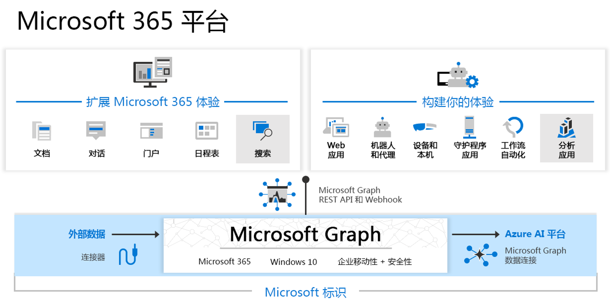

---
# 这是一个marp文件
marp: true

# 这是定义自定义样式
theme: xizhang

# 页面分隔符，3表示标题三或以上都可以拆分页，默认是用 --- 但是那样会破坏MD文件本身的逻辑
headingDivider: 3 

# 是否要显示页码
paginate: true 

# 这个会决定生成的html的标题
title: 第一讲：基本概念 

footer: 全局页脚
header: 全局页首
---

# 大标题
1. 内容
1. 内容

## 二级标题

## 二级标题
<!-- 备注文字，可以在演讲者模式中使用 -->

## 二级标题

